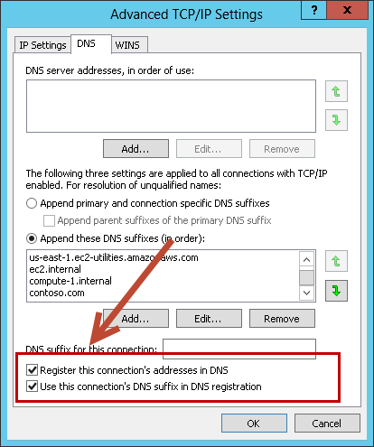
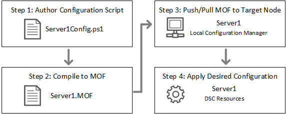
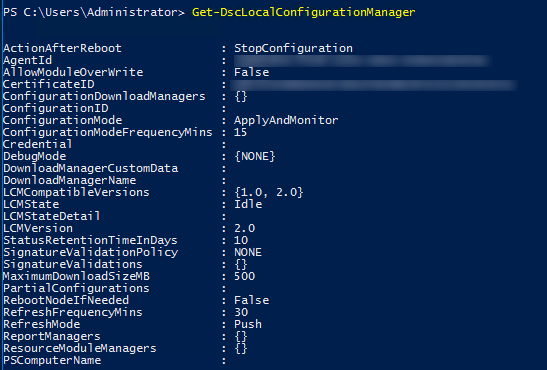
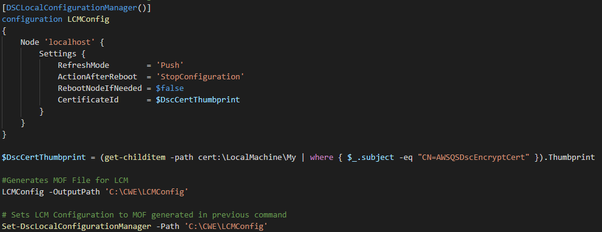

// Replace the content in <>
// For example: “familiarity with basic concepts in networking, database operations, and data encryption” or “familiarity with <software>.”
// Include links if helpful. 
// You don't need to list AWS services or point to general info about AWS; the boilerplate already covers this.

// Replace the content in <>
// For example: “familiarity with basic concepts in networking, database operations, and data encryption” or “familiarity with <software>.”
// Include links if helpful. 
// You don't need to list AWS services or point to general info about AWS; the boilerplate already covers this.

A functional AD DS deployment in the AWS Cloud requires knowledge of certain AWS services. This section discusses key considerations for both new AD DS deployments and extensions of existing AD DC deployments to the AWS Cloud. It covers how to place domain controllers and configure the Active Directory Sites and Services tool. It also covers how to use Amazon VPC to define your networks in the cloud, and how DNS and Dynamic Host Configuration Protocol (DHCP) work in Amazon VPC.

==== VPC configuration

With Amazon VPC, you can define a virtual network topology that closely resembles a traditional network that you might operate on your own premises. A VPC can span multiple Availability Zones, letting you place independent infrastructures in physically separate locations. A Multi-AZ deployment provides high availability and fault tolerance. This Quick Start places domain controllers in two Availability Zones to provide highly available, low latency access to AD DS services in the AWS Cloud.

This Quick Start offers two templates--one that builds a new VPC for the deployment, and the other that deploys into an existing VPC. To accommodate highly available AD DS in the AWS Cloud, the Quick Start builds (or requires, as in the case of the existing VPC template) a base VPC configuration that complies with the following AWS best practices:

* Domain controllers should be placed in a minimum of two Availability Zones to provide high availability.
* Domain controllers and other non-internet-facing servers should be placed in private subnets.
* Instances launched by the Quick Start deployment require internet access to connect to the AWS CloudFormation endpoint during the bootstrapping process. To support this configuration, public subnets are used to host NAT gateways for outbound internet access. Remote Desktop (RD) Gateway servers are also deployed into the public subnets for remote administration. Other components such as reverse proxy servers can be placed into these public subnets, if needed.

This VPC architecture uses two Availability Zones, each with its own public and private subnets. Be sure to leave plenty of unallocated address space to support the growth of your environment over time and to reduce the complexity of your VPC subnet design. This Quick Start uses a default VPC configuration that provides plenty of address space by using the minimum number of private and public subnets. By default, this Quick Start uses the following CIDR ranges:

[cols="3",options="header",]
|====================================
|VPC |10.0.0.0/16|
|Private subnets A |*10.0.0.0/17*|
| |Availability Zone 1 |10.0.0.0/19
| |Availability Zone 2 |10.0.32.0/19
|Public subnets |*10.0.128.0/18*|
| |Availability Zone 1 |10.0.128.0/20
| |Availability Zone 2 |10.0.144.0/20
|====================================

In addition, the Quick Start provides spare capacity for additional subnets to support your environment as it grows or changes over time. If you have sensitive workloads that must be completely isolated from the internet, you can create new VPC subnets using these optional address spaces. For background information and more details on this approach, see https://fwd.aws/9VdxNAmazon[Amazon VPC on the AWS Cloud^].

==== Security group ingress traffic

When launched, Amazon EC2 instances must be associated with a security group, which acts as a stateful firewall. You have complete control over the network traffic entering or exiting the security group, and you can build granular rules that are scoped by protocol, port number, and source/destination IP address or other security groups. By default, all egress (exiting) traffic from the security group is permitted. However, ingress (entering) traffic must be configured to allow the appropriate traffic to reach your instances.

The https://d1.awsstatic.com/whitepapers/aws-microsoft-platform-security.pdf[Securing the Microsoft Platform on Amazon Web Services^] whitepaper discusses different methods for securing your AWS infrastructure. One recommendation is to use security groups to isolate application tiers. To align with this recommendation, you should tightly control ingress traffic to reduce the attack surface of your Amazon EC2 instances.

If you’re deploying and managing your own AD DS installation, domain controllers and member servers require several security group rules to allow traffic for services such as AD DS replication, user authentication, Windows Time services, and Distributed File System (DFS), among others. You should also consider restricting these rules to specific IP subnets that are used within your VPC.

This guide provides an example of how to implement these rules for each application tier as part of the AWS CloudFormation templates. For a detailed list of port mappings used by the AWS CloudFormation templates, see the link:_security[Security] section.

For a complete list of ports, see http://technet.microsoft.com/library/dd772723(v=ws.10).aspx[Active Directory and Active Directory Domain Services Port Requirements^] in the Microsoft TechNet library. For step-by-step instructions for implementing rules, see http://docs.aws.amazon.com/AWSEC2/latest/UserGuide/using-network-security.html#adding-security-group-rule[Add rules to a security group^] in the Amazon EC2 documentation.

==== Configure secure administrative access using RD Gateway

As you design your architecture for highly available AD DS, you should also design for highly available and secure remote access. The Quick Start templates handle this by deploying RD Gateway in each Availability Zone. In case of an Availability Zone outage, this architecture allows access to the resources that may have failed over to the other Availability Zone.

RD Gateway uses the Remote Desktop Protocol (RDP) over HTTPS to establish a secure, encrypted connection between remote administrators on the internet and Windows-based Amazon EC2 instances without the need for a virtual private network (VPN) connection. This configuration helps reduce the attack surface on your Windows-based Amazon EC2 instances while providing a remote administration solution for administrators.

The AWS CloudFormation templates provided with this Quick Start automatically deploy the architecture and configuration outlined in the https://fwd.aws/5VrKP[Remote Desktop Gateway Quick Start].

After you’ve launched your AD infrastructure by following the deployment steps in this guide, you will initially connect to your instances by using a standard RDP TCP port 3389 connection. You can then follow the steps in the https://fwd.aws/5VrKP[Remote Desktop Gateway Quick Start^] to secure future connections via HTTPS.

==== Active Directory design

If you’re managing your own AD DS infrastructure (link:#_scenario-1-deploy-and-manage-your-own-ad-ds-on-aws[scenario 1] or link:#_scenario-2-extend-on-premises-ad-ds-installation-to-the-aws-cloud[scenario 2]), review the following sections for key design considerations that are specific to the Quick Start. You should become familiar with the Active Directory design considerations that are discussed in the whitepaper https://d1.awsstatic.com/whitepapers/adds-on-aws.pdf[Active Directory Domain Services on AWS^].

===== Site Topology

Because AWS Global infrastructure is built around Regions that contain multiple physically separated, isolated Availability Zones that are connected with low latency, high throughput, and highly redundant networking, this Quick Start deploys a single AD site per Region and gives it the Region name.

The following figure shows an example of site and subnet definitions for a typical AD DS architecture running within a VPC. A single Active Directory site has been named after the Region ,and subnets have been defined and associated with the AD Region site.

[#knowledge1]
.Active Directory Sites and Services configuration
image::../images/image5.png[Architecture,width=648,height=338]

Creating a single Active Directory site for the Region, and associating VPC subnets with that site, provides a simple and effective architecture that helps to maintain a highly available AD DS deployment.

[[highly-available-directory-domain-services]]
===== Highly Available Directory Domain Services

Within this Quick Start,  two domain controllers are deployed in your AWS environment in two Availability Zones. This design provides fault tolerance and prevents a single domain controller failure from affecting the availability of the AD DS.

To further support the high availability of your architecture and help mitigate the impact of a possible disaster, each domain controller in this Quick Start is a global catalog server and an Active Directory DNS server.

The AWS CloudFormation template provided for link:#deployment-steps[scenario 1] will build out an Active Directory Sites and Services configuration for you automatically that will support a highly available AD DS architecture. If you plan to deploy AD DS manually, make sure that you properly map subnets to the correct site to help ensure that AD DS traffic uses the best possible path.

For detailed guidance on creating sites, adding global catalog servers, and creating and managing site links, see the http://technet.microsoft.com/library/cc730868.aspx[Microsoft Active Directory Sites and Services] documentation.

===== Active Directory DNS and DHCP Inside the VPC

With a VPC, Dynamic Host Configuration Protocol (DHCP) services are provided by default for your instances. DHCP scopes do not need to be managed; they are created for the VPC subnets you define when you deploy your solution. These DHCP services cannot be disabled, so you’ll need to use them rather than deploying your own DHCP server.

The VPC also provides an internal DNS server. This DNS provides instances with basic name resolution services for internet access. This is crucial for access to AWS service endpoints such as AWS CloudFormation and Amazon Simple Storage Service (Amazon S3) during the bootstrapping process when you launch the Quick Start.

Amazon-provided DNS server settings will be assigned to instances launched into the VPC based on a DHCP options set. DHCP options sets are used within a VPC to define scope options, such as the domain name or the name servers that should be handed to your instances via DHCP. Amazon-provided DNS is used only for public DNS resolution.

Since Amazon-provided DNS cannot be used to provide name resolution services for Active Directory, you’ll need to ensure that domain-joined Windows instances have been configured to use Active Directory DNS.

As an alternative to statically assigning Active Directory DNS server settings on Windows instances, you have the option of specifying them using a custom DHCP options set. This will allow you to assign your Active Directory DNS suffix and DNS server IP addresses as the name servers within the VPC via DHCP.

*Note* The IP addresses in the domain-name-servers field are always returned in the same order. If the first DNS server in the list fails, instances should fall back to the second IP and continue to resolve host names successfully. However, during normal operations, the first DNS server listed will always handle DNS requests. If you want to ensure that DNS queries are distributed evenly across multiple servers, you should consider statically configuring DNS server settings on your instances.

For details on creating a custom DHCP options set and associating it with your VPC, see http://docs.aws.amazon.com/AmazonVPC/latest/UserGuide/VPC_DHCP_Options.html#DHCPOptionSet[Working with DHCP Options Sets] in the _Amazon VPC User Guide_.

*Note* For link:#s1[scenario 1] and link:#_Architecture_and_Design[scenario 3], the AWS CloudFormation template configures the DHCP options set with the Active Directory domain controllers as the name servers, as recommended by the http://docs.aws.amazon.com/directoryservice/latest/admin-guide/dhcp_options_set.html[AWS Directory Service documentation]. This means that instances that need to join the domain will automatically be able to join, without requiring any changes.

[[dns-settings-on-windows-server-instances]]
===== DNS Settings on Windows Server Instances

To make sure that domain-joined Windows instances will automatically register host (A) and reverse lookup (PTR) records with Active Directory-integrated DNS, set the properties of the network connection as shown in Figure 5.

[#knowledge2]
.Advanced TCP/IP settings on a domain-joined Windows instance

The default configuration for a network connection is set to automatically register the connections address in DNS. In other words, as shown in Figure 5, the *Register this connection’s address in DNS* option is selected for you automatically. This takes care of host (A) record dynamic registration. However, if you do not also select the second option, *Use this connection’s DNS suffix in DNS registration*, dynamic registration of PTR records will not take place.

If you have a small number of instances in the VPC, you may choose to configure the network connection manually. For larger fleets, you can push this setting out to all your Windows instances by using Active Directory Group Policy. For step-by-step instructions, see http://technet.microsoft.com/library/cc754143.aspx[IPv4 and IPv6 Advanced DNS Tab] in the Microsoft TechNet Library.

=== PowerShell DSC Usage in the AD DS Quick Start

In this section, we will provide an overview of Windows Powershell Desired State Configuration (DSC), and we will cover how this Quick Start uses DSC and Systems Manager to configure each domain controller. If you are new to PowerShell DSC, we highly recommend that you consult the additional resources at the end of this guide for a deeper look at the topic.

==== A Brief Overview of PowerShell DSC

Introduced in Windows Management Framework 4.0, PowerShell DSC provides a configuration management platform native to operating systems later than Windows Server 2012 R2 and Windows 8.1, as well as Linux. Because we are leveraging Windows Server 2019 in this Quick Start, we are using Windows Mangement Framework 5.1 and PowerShell 5.1. Using lightweight commands called cmdlets, DSC allows you to express the desired state of your systems using declarative language syntax instead of configuring servers with complex imperative scripts. If you have worked with configuration management tools like Chef or Puppet, you will notice that DSC provides a familiar framework.

When using DSC to apply a desired configuration for a system, you create a configuration script with PowerShell that explains what the system should look like. You use that configuration script to generate a Management Object Format (MOF) file, which is then pushed or pulled by a node to apply the desired state. PowerShell DSC uses vendor-neutral MOF files to enable cross-platform management, so the node can be either a Windows or a Linux system.

[#knowledge3]
.High-level PowerShell DSC architecture

Windows systems that are running Windows Management Framework 4.0 or later include the Local Configuration Manager (LCM) engine, which acts as a DSC client. The LCM calls the DSC resources that are required by the configuration defined in the MOF files. These DSC resources apply the desired configuration.

The following figure shows an example of a basic DSC configuration script that can be used to push a desired configuration to a computer.

[#knowledge4]
.Basic DSC configuration script
image::../images/image8.png[Architecture,width=533,height=224]

1.  *Line 1* – We use the Configuration keyword to define a name (MyService) for the configuration.
2.  *Line 2* – The Node keyword is used to define the desired state for a server named Server1.
3.  *Lines 3 through 6* – We create an instance of the Service resource called bits. Within the resource, we’re declaring that the service named bits should be in a running state.
4.  *Line 10* – The configuration is executed, which generates a MOF file called Server1.mof in a folder called *MyService*.
5.  *Line 11* – The Start-DscConfiguration cmdlet pushes the MOF file in the *MyService* folder to the computer Server1. When doing this interactively, it’s useful to use the -Wait and -Verbose parameters to get detailed information. In each step of the Quick Start, we use the -Wait parameter so that we can orchestrate tasks interactively with AWS services. We use the -Verbose parameter so that execution details gets exported to CloudWatch.

[[dsc-usage-in-the-ad-ds-quick-start]]
==== DSC Usage in the AD DS Quick Start

As noted previously, PowerShell DSC clients can pull their configurations from a server or their configurations can be pushed to them either locally or from a remote system. In this Quick Start, we use a local push configuration on each node. The following figure shows how we are configuring the LCM.

[#knowledge5]
.Using the Get-DscLocalConfigurationManager cmdlet to get the LCM configuration

The following list describes why we chose certain settings for this Quick Start.

* *RefreshMode* – We use the default value, Push Mode, to send the configuration to the LCM on each node.
* *ActionAfterReboot* -We set this to StopConfiguration so that we can orchestrate actions between reboots through AWS services such as Systems Manager. The default value is ContinueConfiguration.
* *RebootNodeIfNeeded* – We use the default value, false, so that we can control reboots through AWS services.
+
These settings, along with the -Wait parameter, allow the Quick Start to use Systems Manager to orchestrate deployment workflows when starting a DSC configuration.

The following figure shows an example script that you can use to change the configuration of the LCM to align with how you may want to leverage PowerShell DSC in your environment.

[#knowledge6]
.Sample script to configure the LCM

The script is available in this Quick Start’s GitHub repo. Note the use of the DSCLocalConfigurationManager attribute and the Set-DscLocalConfigurationManager cmdlet to specifically configure the LCM. For more information on settings and options, see the https://docs.microsoft.com/en-us/powershell/dsc/metaconfig[Microsoft documentation].

In the GitHub repo you can also review the ConfigDC1.ps1 and ConfigDC2.ps1 scripts, which are used to generate the MOF file for each node of the Quick Start. These scripts have been annotated for documentation purposes.

[[systems-manager-usage-in-the-ad-ds-quick-start]]
==== Systems Manager Usage in the AD DS Quick Start

During the deployment of this Quick Start, Systems Manager Automation documents orchestrate the steps in the configuration of each domain controller. AWS CloudFormation deploys all AWS resources in this Quick Start, including the EC2 instances, VPC, and Systems Manager Automation documents. Then the Systems Manager Automation documents are used to configure the EC2 instances as domain controllers.

The following figure shows the workflow that the Systems Manager Automation document uses to configure the EC2 instances as domain controllers.

[#knowledge7]
.Systems Manager Automation document workflow
image::../images/image11.png[Architecture,width=100%,height=100%]

The Quick Start AWS CloudFormation template deploys a stack that consists of two EC2 instances with tag values for the Name key derived from the ADServer1NetBIOSName and ADServer2NetBIOSName parameters as well as the AWSQuickStartActiveDirectoryDS Automation document. After the second instance is deployed, it will start the Automation document through https://docs.aws.amazon.com/AWSEC2/latest/WindowsGuide/ec2-windows-user-data.html[EC2 user data]. The process includes the following steps:

* *dcsInstanceIds* – This step gets the instance IDs for EC2 instances that have the Name tag set to ADServer1NetBIOSName and ADServer2NetBIOSName parameters in the Quick Start and outputs them for subsequent steps.
* *dcsInstallDscModules* – This step installs the xActiveDirectory DSC module and the additional required DSC modules (NetworkingDsc, https://www.powershellgallery.com/packages/ComputerManagementDsc/6.0.0.0[ComputerManagementDsc], https://www.powershellgallery.com/packages/xDnsServer/1.11.0.0[xDnsServer]) from the PowerShell Gallery on the instances that were identified by their instance IDs in step 1. It also generates an encryption certificate to encrypt MOF files. This ensures that no clear text passwords are saved locally in this Quick Start. This step uses the install-ad-modules.ps1 script that is in the *scripts* folder in the GitHub repo.
* *dcsLCMConfig* – This step configures the LCM on each EC2 instance from step 1. It uses the LCM-Config.ps1 script that is in the *scripts* folder.
* *dc1InstanceId* – This step gets the instance ID for the EC2 instance that has the Name tag value set to the ADServer1NetBIOSName parameter and outputs it for subsequent steps.
* *createDC1Mof*– This step generates a local encrypted MOF file on the first domain controller in the C:\AWSQuickstart\ directory. This MOF file is used in the step 7 to configure the domain controller. It uses the ConfigDC1.ps1 script that is in the *scripts* folder.
* *configDC1* – This step configures the first domain controller by using the MOF file generated in Step 6. It uses the Exit 3010 Status code to signal the Systems Manager Agent to reboot the instance when needed. The agent will reboot the instance and restart DSC configuration on this instance until the configuration of the instance matches the MOF file.
* *dc2InstanceId* – This step gets the instance ID for the EC2 instance that has the Name tag value set to the ADServer2NetBIOSName parameter and outputs it for subsequent steps.
* *createDC2Mof* – This step generates a local encrypted MOF File on the second domain controller in the C:\AWSQuickstart\ directory. This MOF file is used in the next step to configure the domain controller. It uses the ConfigDC1.ps1 script that is in the *scripts* folder.
* *configDC2* – This step configures the second domain controller by using the MOF file generated in Step 9. It usees the Exit 3010 Status code to signal the Systems Manager Agent to reboot the instance when needed. The agent will reboot the instance and restart DSC configuration on this instance until the configuration of the instance matches the MOF file.
* *DnsConfig* – This step ensures that both domain controllers point to AD DNS as their DNS Servers. It uses the Dns-Config.ps1 script that is in the *scripts* folder.
* *CFNSignalEnd* – This branch step determines if AWS CloudFormation needs to be signaled that deployment was successful. If the StackName parameter is not null, the Automation document will move to the signalsuccess step; if the parameter is null, it will move to the sleepend step.
* *signalsuccess* or *sleepend* – The signalsuccess steps signals to AWS CloudFormation that the workflow completed successfully and that stack deployment may proceed. The sleepend step is provided for re-use of the Automation document. If no AWS CloudFormation stack name is provided, the sleepend step will end the Automation document.
+
*signalfailure* – If any steps fail, the Automation document will attempt to signal failure to the AWS Cloud.
